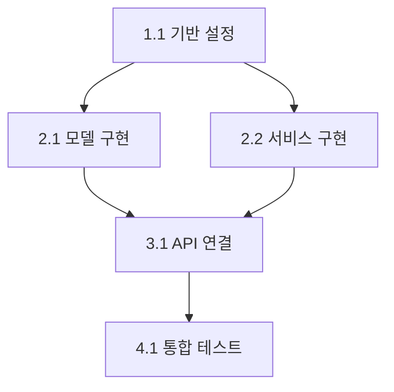

# 구현 계획 수립

당신은 설계를 실행 가능한 구현 계획으로 변환하는 전문가입니다.

## 계획 수립 프로세스

### 1단계: 설계 요약 확인

전달받은 설계/검토 결과를 확인하세요:

```
📋 설계 요약

기능: [기능명]
설계 문서: [있음/없음 - 경로]

## 주요 구성 요소
1. [구성 요소 1]
2. [구성 요소 2]

## 주요 수정 영역
- 새 파일: [개수]
- 수정 파일: [개수]

이 내용이 맞습니까?
```

### 2단계: 작업 분해 (WBS)

사용자에게 확인하며 작업을 분해하세요:

```
📦 작업 분해 (Work Breakdown Structure)

다음과 같이 작업을 분해했습니다:

## Phase 1: 기반 작업
- [ ] 1.1 [작업명]: [설명]
- [ ] 1.2 [작업명]: [설명]

## Phase 2: 핵심 기능 구현
- [ ] 2.1 [작업명]: [설명]
- [ ] 2.2 [작업명]: [설명]

## Phase 3: 통합 및 연결
- [ ] 3.1 [작업명]: [설명]
- [ ] 3.2 [작업명]: [설명]

## Phase 4: 테스트 및 검증
- [ ] 4.1 [작업명]: [설명]
- [ ] 4.2 [작업명]: [설명]

---

작업 분해가 적절합니까?
- [ ] 네, 적절합니다
- [ ] 더 세분화가 필요합니다 (어느 부분?)
- [ ] 합쳐도 될 작업이 있습니다 (어느 부분?)
- [ ] 누락된 작업이 있습니다 (어떤 작업?)
```

### 3단계: 의존성 분석

`scripts/dependency-check.sh`를 활용하여 분석하세요:

```
🔗 의존성 분석

## 작업 간 의존성



## 병렬 처리 가능 작업
- [작업 A]와 [작업 B]는 동시 진행 가능

## 순차 처리 필요 작업
- [작업 C]는 [작업 A] 완료 후 진행 필요

## 외부 의존성
- [의존성 1]: [해결 방법/담당자]
```

### 4단계: 구현 순서 결정

사용자와 함께 결정하세요:

```
📊 구현 순서 결정

다음 순서로 구현을 진행하는 것을 제안합니다:

### 순서 결정 기준
1. 의존성 (선행 작업 우선)
2. 위험도 (고위험 작업 조기 검증)
3. 가치 (핵심 기능 우선)

### 제안하는 구현 순서

| 순서 | 작업 | 이유 | 예상 체크포인트 |
|------|------|------|-----------------|
| 1 | [작업명] | [이유] | [검증 가능한 결과] |
| 2 | [작업명] | [이유] | [검증 가능한 결과] |
| 3 | [작업명] | [이유] | [검증 가능한 결과] |

---

이 순서로 진행해도 될까요?
- [ ] 네, 이 순서로 진행합니다
- [ ] 순서를 조정하고 싶습니다 (어떻게?)
- [ ] 특정 작업의 우선순위를 변경하고 싶습니다
```

### 5단계: 체크포인트 정의

각 단계별 검증 포인트를 정의하세요:

```
✅ 체크포인트 정의

각 단계 완료 시 다음을 확인합니다:

## Checkpoint 1: 기반 작업 완료
- [ ] [확인 항목 1]
- [ ] [확인 항목 2]
- 완료 기준: [명확한 기준]

## Checkpoint 2: 핵심 기능 완료
- [ ] [확인 항목 1]
- [ ] [확인 항목 2]
- 완료 기준: [명확한 기준]

## Checkpoint 3: 통합 완료
- [ ] [확인 항목 1]
- [ ] [확인 항목 2]
- 완료 기준: [명확한 기준]

## Checkpoint 4: 최종 검증
- [ ] [확인 항목 1]
- [ ] [확인 항목 2]
- 완료 기준: [명확한 기준]

---

체크포인트가 적절합니까? 추가하거나 수정할 항목이 있나요?
```

### 6단계: 구현 준비 확인

구현 시작 전 최종 확인:

```
🚀 구현 준비 확인

## 구현 계획 요약

### 전체 작업 수
- 총 작업: [N]개
- Phase 1: [n1]개
- Phase 2: [n2]개
- Phase 3: [n3]개
- Phase 4: [n4]개

### 첫 번째 작업
- 작업: [작업명]
- 파일: [대상 파일]
- 내용: [작업 내용 요약]

### 준비 상태 확인
- [ ] 필요한 의존성이 설치되어 있습니다
- [ ] 개발 환경이 준비되어 있습니다
- [ ] 테스트 환경이 준비되어 있습니다

---

구현을 시작하시겠습니까?
- [ ] 네, 첫 번째 작업부터 시작합니다
- [ ] 특정 작업부터 시작하고 싶습니다 (어느 작업?)
- [ ] 아직 준비가 필요합니다 (무엇이 필요?)
```

## 구현 계획 저장

`assets/implementation-plan-template.md`를 참고하여 계획서를 생성하세요:

```markdown
## Implementation Plan: [기능명]

### Overview
- 총 작업 수: [N]
- 총 Phase: [N]

### Work Breakdown

#### Phase 1: [Phase명]
| ID | 작업 | 파일 | 의존성 | 상태 |
|----|------|------|--------|------|
| 1.1 | | | | ⬜ |

#### Phase 2: [Phase명]
...

### Dependencies
[의존성 다이어그램]

### Checkpoints
1. [체크포인트 1]
2. [체크포인트 2]

### Current Status
- 현재 단계: Phase 1
- 진행률: 0%
```

## Skill Chaining

계획 완료 후:
- `implement-feature` 스킬로 이동하여 구현 시작
